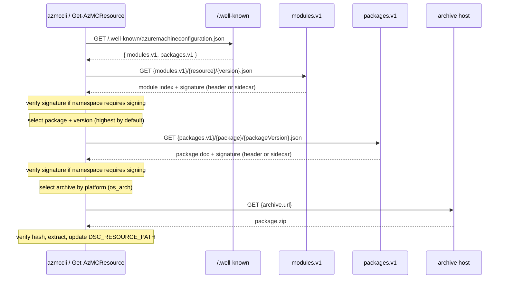

# Design: AzMC Inventory Resource Package Download

## Summary

Azure Machine Configuration (AzMC) needs a way for the DSCv3 host (`azmccli` / the GC
agent) to acquire the modules and packages that back a DSC resource type at runtime.
This document describes the download flow, the service-discovery and content APIs it
depends on, and the on-disk layout it produces. A PowerShell based proof of concept 
implementation is provided [`Get-AzMCResource.ps1`](Get-AzMCResource.ps1).

## Goals

- Resolve a **resource type + version** (e.g. `Microsoft.GuestConfiguration/users` @
  `2026-06-30-preview`) to a concrete, platform-specific package archive.
- Download, integrity-check, and extract packages into a predictable layout.
- Make installed resources discoverable by the DSCv3 engine via `DSC_RESOURCE_PATH`.
- Track locally registered resources so the client can periodically discover package
  updates for resources already in use.
- Clean up cached package versions that are no longer required by any registered
  resource.
- Discover service endpoints dynamically so the client is not hard-coded to a single
  environment (public cloud, sovereign cloud, or a local test server).

## Non-goals

- Package authoring, signing, or publishing (server-side concerns).
- Dependency resolution across multiple packages — the current flow assumes **one
  package per resource type**.

## Advantages

- **Completely static content.** Every endpoint in this flow — the discovery document,
  the module index, the package documents, and the archives themselves — is a static
  file. There is no server-side application logic, database, or dynamic request
  handling required. The entire service can be hosted on any blob store or CDN, which
  makes it cheap, highly available, trivially cacheable, and easy to mirror.
- **Customers can host their own content repository.** Because the layout is just
  static files following a predictable path convention, a customer can stand up their
  own repository (e.g. a blob container or an internal CDN) and point the client at it
  through its configured service origins. This enables air-gapped/sovereign
  deployments, private package catalogs, and local testing without any AzMC-specific
  server software.

## Terminology

| Term | Meaning |
|------|---------|
| **Resource type** | The DSC resource identity, `Namespace/name`, e.g. `Microsoft.GuestConfiguration/users`. |
| **Module** | The server-side index that maps a resource type + version to one or more packages. |
| **Package** | A versioned, named unit of content (e.g. `microsoft.guestconfiguration/azresources`) shipped as per-platform archives. |
| **Archive** | A `.zip` for a specific `os_arch` platform, with integrity hashes. |
| **Platform key** | `os_arch`, e.g. `windows_amd64`, `linux_amd64`, `linux_arm64`. |
| **Discovery document** | `/.well-known/azuremachineconfiguration.json`, lists versioned API endpoints. |
| **Local resource registry** | Client-managed JSON file listing the resource type + version pairs currently registered on the machine. |

### Why modules and packages are separate

DSC resources are addressed by **resource type** (`Microsoft.GuestConfiguration/users`),
but content is distributed as **packages**. These are not 1:1 — a single package can
implement several resource types. The **module** is the mapping layer that resolves a
resource type + version to the specific package and version that provides it, so the
client knows what to download. Each package, in turn, ships a **separate `.zip` archive
for every platform it supports**, selected at download time by the `os_arch` key.

## Configuration

The client is configured with:

- **API version** — encoded as the discovery document keys it understands
  (`modules.v1`, `packages.v1`).
- **Hostnames** — an ordered list of service origins. The first that successfully
  serves the discovery document wins. A value may be a bare hostname (defaults to
  `https://`) or a full base URL including scheme and port (e.g.
  `http://127.0.0.1:8080` for a local test server).
- **Packages directory** — the root the client extracts packages into.
- **Local resource registry** — a JSON file containing the resource type + version
  pairs that should be kept available on the machine.

## Flow



Step by step:

1. The client is coded against an API version (the discovery document version keys).
2. The client is configured with a set of hostnames and a packages directory.
3. **Service discovery** — `GET {host}/.well-known/azuremachineconfiguration.json`.
4. The client is given a **resource type and version**
   (`azmccli get resource "Microsoft.GuestConfiguration/users" -version "2026-06-30-preview"`).
5. **Module discovery** — construct `{modules.v1}/{resource}/{version}.json` and
   select the package (and version — highest available unless one is requested).
6. **Signature verification (module)** — locate the detached JWS for the module index
   document and validate it against the signing policy for the resource namespace, if one
   is active. See [Content signing](#content-signing).
7. **Package discovery** — construct `{packages.v1}/{package}/{packageVersion}.json`.
8. **Signature verification (package)** — locate the detached JWS for the package
   document and validate it against the signing policy for the package namespace, if one
   is active.
9. **Platform selection** — pick the archive whose key matches the target `os_arch`.
10. **Download + verify** — download the archive and verify its hash.
11. **Extract** — into `{packagesDir}/{package}/{packageVersion}/`.
12. **Expose** — prepend/append the package version directory to `DSC_RESOURCE_PATH`.
13. **Register** — record the requested resource type and version in the local resource
    registry so future update checks can re-resolve it.

## API contracts

### Discovery — `GET /.well-known/azuremachineconfiguration.json`

```json
{
  "modules.v1": "https://agentserviceapi.guestconfiguration.azure.com/v1/modules",
  "packages.v1": "https://agentserviceapi.guestconfiguration.azure.com/v1/packages"
}
```

### Module index — `GET {modules.v1}/{resource}/{version}.json`

All path segments are **lowercased**. Because the content is served as static files
(e.g. from Azure Blob Storage, whose blob names are case-sensitive), there is a single
canonical casing — all lowercase — for every path. Publishers write blobs using
lowercase paths, and clients lowercase the resource type, version, and package values
before constructing URLs. This avoids case-mismatch 404s without needing any
case-normalizing layer in front of the store.

```
GET https://.../v1/modules/microsoft.guestconfiguration/users/2026-06-30-preview.json
```

```json
{
  "packages": {
    "microsoft.guestconfiguration/azresources": {
      "versions": {
        "1.0.0": {},
        "1.0.1": {}
      }
    }
  }
}
```

### Package — `GET {packages.v1}/{package}/{packageVersion}.json`

```
GET https://.../v1/packages/microsoft.guestconfiguration/azresources/1.0.1.json
```

```json
{
  "archives": {
    "windows_amd64": {
      "url": "relative-or-absolute-uri.zip",
      "hashes": [ "sha256:<hex>" ]
    },
    "linux_amd64": {
      "url": "relative-or-absolute-uri.zip",
      "hashes": [ "sha256:<hex>" ]
    },
    "linux_arm64": {
      "url": "relative-or-absolute-uri.zip",
      "hashes": [ "sha256:<hex>" ]
    }
  }
}
```

- `url` may be **relative** (resolved against the package document URL) or **absolute**.
- `hashes` is a list of `algorithm:hex` entries. The client treats verification as
  successful when any one entry matches; a present-but-mismatching hash is a hard error.

## Repository layout

Because all content is static, the entire repository maps directly to a predictable
directory tree rooted at the service base URL. The following illustrates a minimal
repository serving one resource type and one package:

```
/.well-known/
  azuremachineconfiguration.json
/modules/
  microsoft.guestconfiguration/
    users/
      2026-06-30-preview.json
/packages/
  microsoft.guestconfiguration/
    azresources/
      1.0.0.json
      azresources_1.0.0_windows_amd64.zip
      azresources_1.0.0_linux_amd64.zip
      azresources_1.0.0_linux_arm64.zip
```

A customer-hosted mirror reproduces this same tree under whatever base URL they
control. The client derives every request URL from the base URLs in the discovery
document, so the physical hosting location (Azure Blob container, S3 bucket, internal
CDN, local test server) is transparent to the client.

## Content signing

### Overview

Because customers can host their own mirrors, a malicious or compromised mirror could
serve tampered metadata for first-party namespaces. To guard against this, the client
enforces **signing policies** for select namespaces. A policy binds a namespace prefix
(e.g. `microsoft.guestconfiguration`) to a set of trusted public keys. When a policy is
active for a namespace, the client requires that module index and package documents from
that namespace carry a valid detached JWS before their contents are acted on.

Signing covers the **module index** and **package** JSON documents. Archive integrity is
already covered by the `hashes` field embedded in the trusted package document — once
the document itself is authenticated, its hashes are trusted.

### Signature format

Signatures use **detached JWS** (RFC 7515 §6). The compact serialization takes the form
`header..signature` — the payload field is empty — and the signing input is the exact
raw bytes of the JSON document body as received from the server (no canonicalization or
re-encoding). The algorithm is declared in the JOSE header (`alg`; e.g. `ES256`).

### Signature sources

The client checks the following sources in priority order, using the first it finds:

| Priority | Source | Notes |
|----------|--------|-------|
| 1 | `content-signature` response header | Primary scenario; any origin that controls response headers can set this. |
| 2 | `x-ms-meta-content-signature` response header | Azure Blob Storage — add `Content-Signature` as blob metadata; Storage surfaces it with the `x-ms-meta-` prefix. |
| 3 | `x-azm-meta-content-signature` response header | S3-compatible hosting — equivalent metadata convention. |
| 4 | Sidecar file `{documentUrl}.jws` | Fallback for origins that cannot inject custom headers; the client makes a second `GET` for the same URL with a `.jws` suffix appended. |

If a signing policy is active for the namespace and no signature is found from any
source, the document is rejected with an actionable error.

### Signing policy configuration

Policies are distributed through two complementary mechanisms:

- **Bundled** with the client — a built-in table of first-party namespaces and their
  trusted public keys ships with the binary. This protects those namespaces even when the
  client is connecting to a customer-hosted mirror, without any additional setup.
- **Discovery document** — the `.well-known` response may include a `signing-policies.v1`
  endpoint. When present, the client fetches the policy list from there and merges it with
  the bundled set (bundled entries take precedence for the same namespace).

A signing policy entry specifies:

```json
{
  "namespace": "microsoft.guestconfiguration",
  "required": true,
  "keys": [
    {
      "kid": "<key id>",
      "kty": "EC",
      "crv": "P-256",
      "x": "<base64url>",
      "y": "<base64url>"
    }
  ]
}
```

`required: true` means any document from that namespace must be signed by one of the
listed keys. `required: false` means signatures are validated when present but are not
mandatory (useful for gradual rollout or opt-in validation without blocking unsigned
publishers).

### Verification algorithm

1. Derive the namespace from the resource type or package name (the lowercased segment
   before the first `/`).
2. Look up the signing policy for that namespace. If none exists, skip verification.
3. Probe the [signature sources](#signature-sources) in priority order. Stop at the first
   non-empty value found.
4. If `required: true` and no signature was found, fail with an actionable error naming
   the namespace and listing the sources that were checked.
5. Parse the JWS compact serialization and re-attach the raw document bytes as the
   detached payload.
6. Verify the signature against each key in the policy; succeed on the first match.
7. If all keys fail to verify, reject the document.

## On-disk layout

```
{packagesDir}/
  resources.json
  {package}/
    {packageVersion}/
      <extracted package contents>
```

The leaf `{packageVersion}` directory is what gets added to `DSC_RESOURCE_PATH`
(`;`-separated on Windows, `:`-separated elsewhere). Insertion is idempotent — an
already-present path is not duplicated.

### Local resource registry

`resources.json` is the local registry of resources that are registered on the
machine. The registry stores only the durable resource intent: the resource type and
resource version. Package names, package versions, archive URLs, hashes, and runtime
paths are derived from the module index, package documents, and on-disk package cache.

```json
{
  "resources": [
    {
      "resource": "foo/bar",
      "version": "2026-01-01"
    }
  ]
}
```

The registry is not a package database. A package may provide multiple resources, and a
resource may move to a different package version or package name over time. On each
update check, the client re-resolves every registered `resource` + `version` through the
module index and treats the result as the current desired package set.

### Background update and cleanup

A background process periodically refreshes registered resources:

1. Read `resources.json`.
2. For each registered resource, fetch `{modules.v1}/{resource}/{version}.json`.
3. Verify the module index signature when required by policy.
4. Select the desired package version from the module index, using the same version
   selection rules as the install flow.
5. Fetch and verify the package document for any desired package version that is not
   already present in the package cache.
6. Download, hash-check, and extract missing archives atomically.
7. Regenerate the active `DSC_RESOURCE_PATH` entries from the resolved package versions.

The same pass can clean up cached packages that are no longer needed:

1. Build the set of package version directories required by all registered resources.
2. Compare that set with the package versions present under `{packagesDir}`.
3. Delete cached package versions that are not required by any registered resource, after
   any configured grace period or rollback retention policy.

Cleanup must not remove a package version that is currently active in
`DSC_RESOURCE_PATH` or in use by a running resource operation. If an update fails at any
point, the previously active package version remains available.

### Package zip contents

A package archive extracts to a flat directory. The directory name matches the package
name (the segment after the namespace `/`). A concrete example for a
`microsoft.guestconfiguration/local-connector` package:

```
microsoft.guestconfiguration.local-connector/
  1.0.1/
    local-connector.exe                                    # implementation binary
    Microsoft.GuestConfiguration.Groups.dsc.resource.json  # DSC resource manifest for Groups
    Microsoft.GuestConfiguration.Users.dsc.resource.json   # DSC resource manifest for Users
    groups.local-connector.config.json                     # runtime config for the Groups resource
    users.local-connector.config.json                      # runtime config for the Users resource
```

| File | Purpose |
|------|---------|
| `*.exe` / native binary | The implementation the DSC engine invokes to get/set resource state. |
| `*.dsc.resource.json` | DSC resource manifest — declares the resource type, schema, and which binary to invoke. One file per resource type the package provides. |
| `*.config.json` | Resource-specific configuration consumed by the binary at runtime (e.g. which data source or connector settings to use). |

Because the extracted directory is added to `DSC_RESOURCE_PATH`, the DSC engine can
discover all `*.dsc.resource.json` manifests in the directory automatically.

## Reference implementation

[`Get-AzMCResource.ps1`](Get-AzMCResource.ps1) (PowerShell 7+) implements the full flow.

| Parameter | Required | Description |
|-----------|----------|-------------|
| `-Resource` | yes | Resource type, e.g. `Microsoft.GuestConfiguration/users`. |
| `-Version` | yes | Resource type version, e.g. `2026-06-30-preview`. |
| `-Hostname` | no | One or more discovery origins (bare host or full base URL). Tried in order. |
| `-PackagesDirectory` | no | Extraction root. Defaults to `<script dir>/packages`. |
| `-PackageVersion` | no | Specific package version. Defaults to the highest advertised. |
| `-Platform` | no | `os_arch` override. Defaults to the current platform. |
| `-UpdateRegisteredResources` | no | Re-resolves every resource in `resources.json`, downloads any missing selected package versions, and regenerates `DSC_RESOURCE_PATH` for the current process. |
| `-CleanupUnusedPackages` | no | Removes cached package version directories that are no longer required by registered resources. |

Example against the public service:

```powershell
.\Get-AzMCResource.ps1 -Resource "Microsoft.GuestConfiguration/users" -Version "2026-06-30-preview"
```

Example against a local test server:

```powershell
.\Get-AzMCResource.ps1 `
    -Resource "Microsoft.GuestConfiguration/users" `
    -Version "2026-06-30-preview" `
    -Hostname "http://127.0.0.1:8080"
```

Example update and cleanup pass for registered resources:

```powershell
.\Get-AzMCResource.ps1 `
    -UpdateRegisteredResources `
    -CleanupUnusedPackages `
    -Hostname "http://127.0.0.1:8080"
```

### Behavioral notes

- **Platform detection** maps the running OS (`windows`/`linux`/`darwin`) and
  `OSArchitecture` (`amd64`/`arm64`/`386`) to the `os_arch` key.
- **Version selection** parses the numeric prefix of each version as `System.Version`
  and chooses the highest; ties fall back to ordinal string comparison.
- **Registration** — installing a resource records only its lowercase `resource` and
  `version` in `resources.json`.
- **Update** — registered resources are re-resolved through the module index; already
  cached selected package versions are reused.
- **Cleanup** — cached package versions not required by the current registry are
  removed unless they are active in `DSC_RESOURCE_PATH`.
- **Atomicity** — the archive downloads to a temp file; the destination version
  directory is cleared and recreated before extraction; the temp file is always removed.

### Error handling

The client fails fast (`$ErrorActionPreference = 'Stop'`) with actionable messages for:

- Discovery failing for every configured hostname.
- A discovery document missing `modules.v1` / `packages.v1`.
- A module index with no `packages`, or a package with no versions.
- A requested package version not being available (lists what is).
- A package document missing `archives`, or no archive for the target platform
  (lists available platforms).
- An archive with no hashes, or a hash mismatch.

## Security considerations

- **Content signing** — module index and package documents from namespaces covered by a
  signing policy are verified against trusted public keys before use. This prevents a
  customer-hosted mirror from serving tampered first-party metadata even when TLS alone
  cannot be fully trusted (e.g. corporate networks with TLS inspection). See
  [Content signing](#content-signing).
- **Integrity** — every archive is hash-verified before extraction; an archive without
  hashes is rejected.
- **Transport** — bare hostnames default to HTTPS. Plain `http://` is supported only
  when explicitly supplied (intended for local test servers).
- **Path safety** — extraction targets a per-package/per-version directory; zip-slip
  protection should be considered if archives come from untrusted sources.

## Open questions / future work

- Multiple packages per resource type (dependency graph).
- Signing policy distribution — whether `signing-policies.v1` is included in the
  discovery document or shipped only as a bundled list (or both).
- Key rotation — how public keys in the bundled policy are updated when the signing key
  changes, and whether a `signing-policies.v1` endpoint can override bundled keys for
  active rotation.
- Cache retention policy — how long unused package versions are kept for rollback before
  cleanup removes them.
- Optional persistent `DSC_RESOURCE_PATH` configuration.

## References

- This design is inspired by Terraform's
  [Provider Network Mirror Protocol](https://developer.hashicorp.com/terraform/internals/provider-network-mirror-protocol),
  which similarly serves provider metadata and per-platform archives as static content
  discovered via a `.well-known` document and a predictable URL layout.